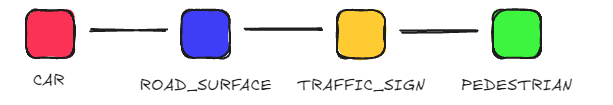
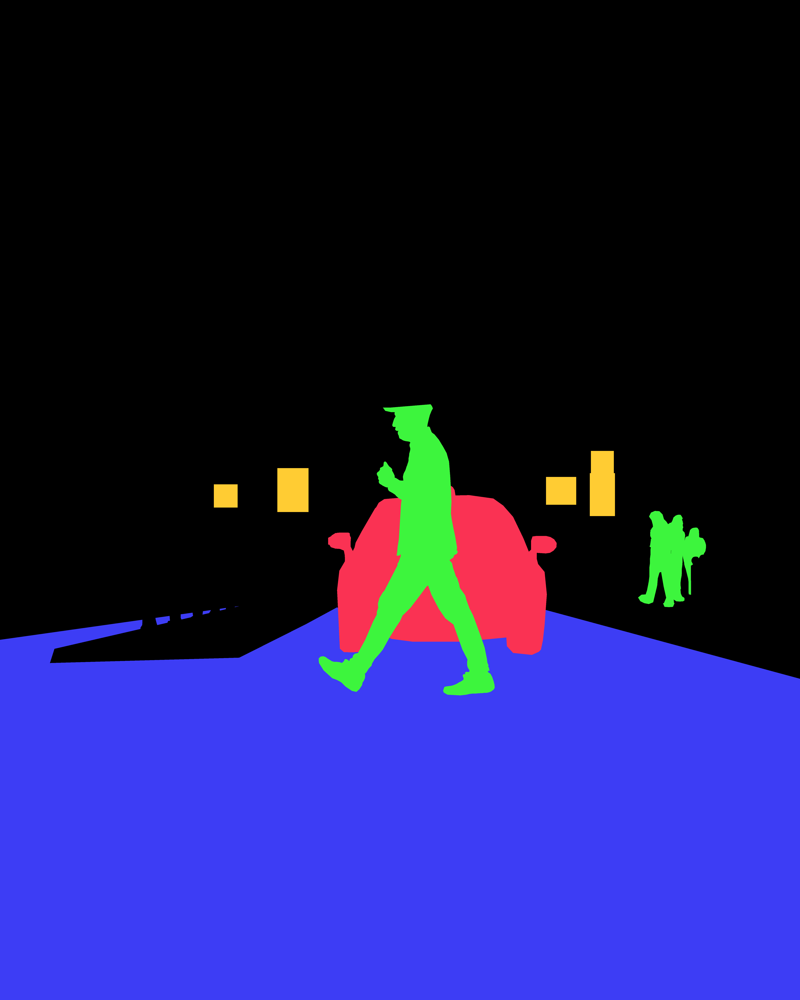
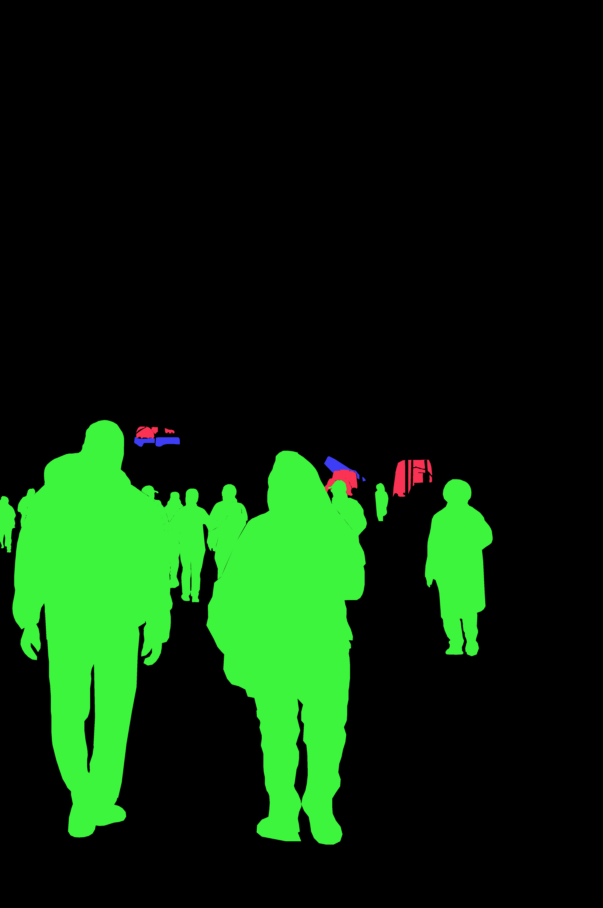
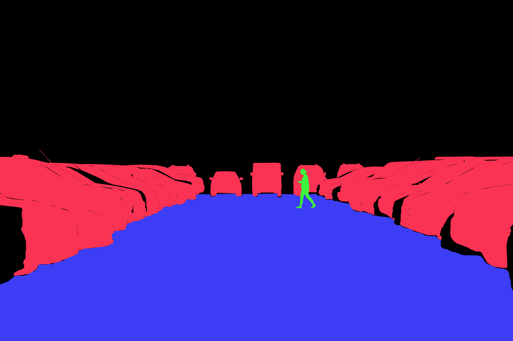
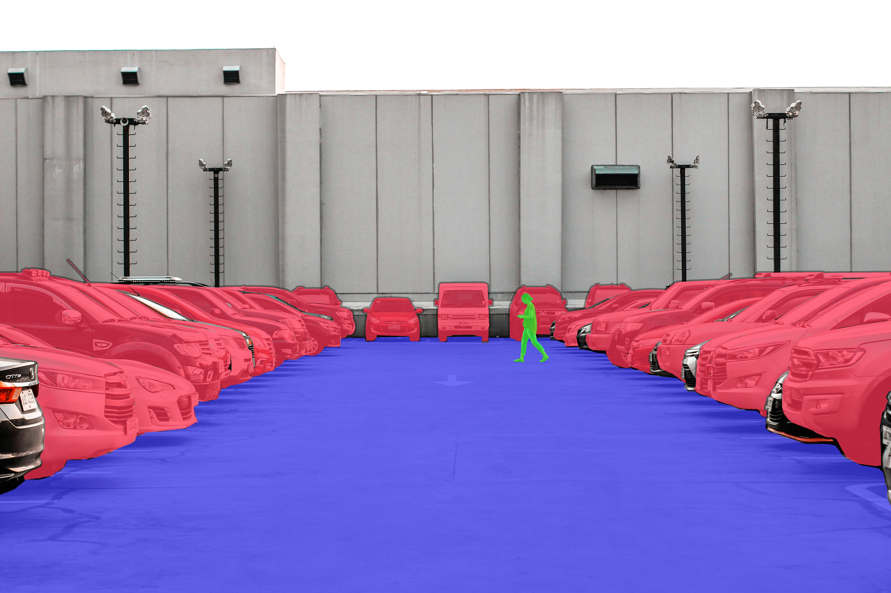
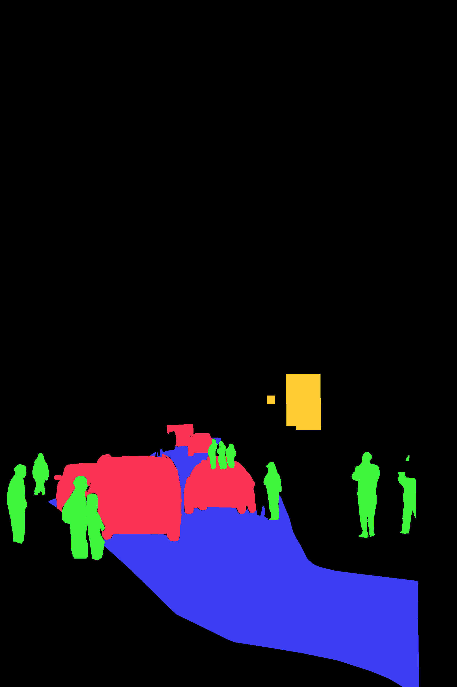
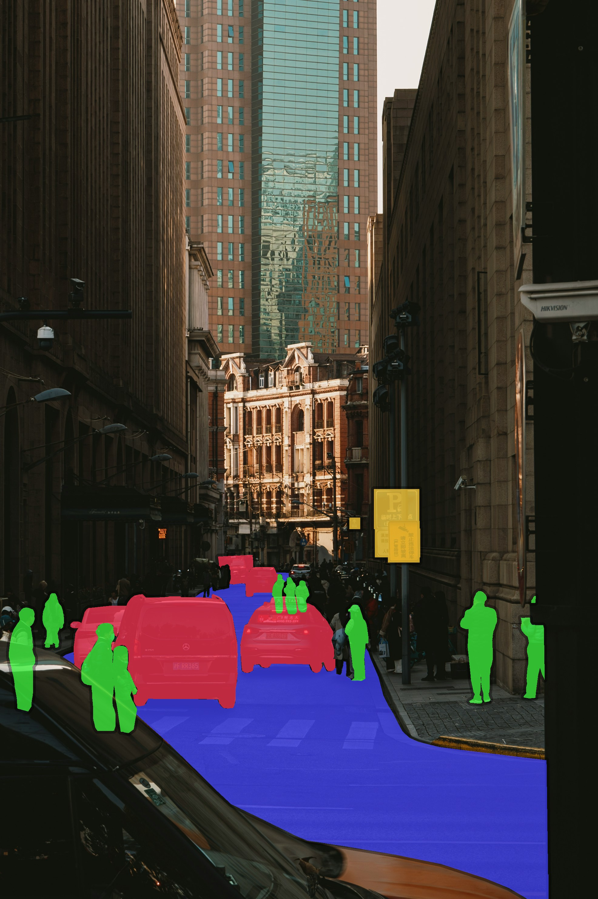
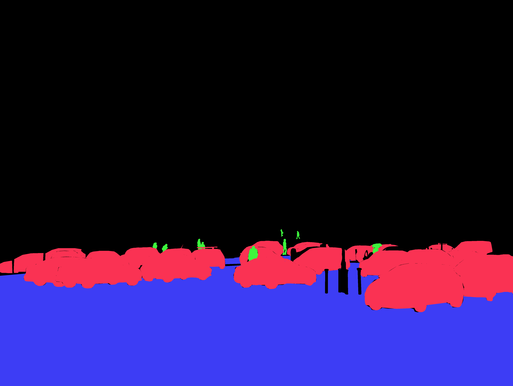
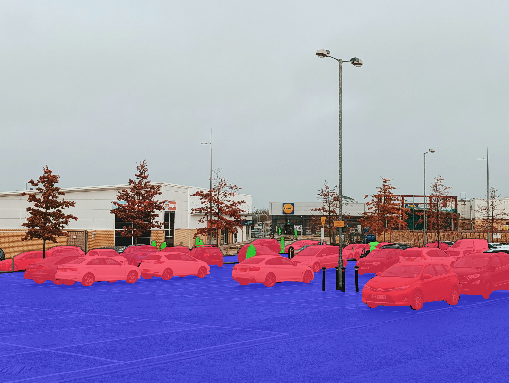

# Urban Scene Data Annotation

## Table of Contents

- [Urban Scene Data Annotation](#urban-scene-data-annotation)
  - [Table of Contents](#table-of-contents)
  - [Summary](#summary)
  - [Skills Demonstrated](#skills-demonstrated)
  - [Goal](#goal)
  - [Project Background](#project-background)
  - [Dataset Overview](#dataset-overview)
  - [Annotation Methodology](#annotation-methodology)
  - [Guidelines](#guidelines)
  - [QA (Quality Assurance)](#qa-quality-assurance)
  - [Visual Example](#visual-example)
  - [Data Deliverable (.xml)](#data-deliverable-xml)
  - [Results](#results)
  - [Challenges](#challenges)
  - [Conclusion](#conclusion)

## Summary

This project demonstrates my experience with labeling objects and creating guidelines for computer vision applications. It showcases a 20-image multi-label dataset with a total of 313 annotated objects for object detection.

Annotations were performed using the CVAT.ai website, including instance and semantic segmentation, bounding boxes, attributes, and image tags.

I wrote my own guidelines and adhered to them. Each annotation was double-checked against the guidelines, and after all images were completed, they were checked one last time.

## Skills Demonstrated

- Object detection data annotation
- Instance and semantic segmentation
- Bounding box labeling
- Using attributes, such as occlusion and truncation
- Annotation guidelines design
- Quality assurance and consistency checks

## Goal

The goal was to create a training-ready dataset of urban objects for an object detection computer vision model.

## Project Background

This project aims to create a robust dataset for training AI models to classify various objects found in urban environments.

Four types of annotation are applied:

- Cars and pedestrians are labeled using **instance segmentation**, so models can distinguish between individual instances.

- Road surfaces are labeled using **semantic segmentation** because models only need to classify every pixel as a road or not a road, and individual road segments do not require a unique ID.

- Traffic signs use **bounding boxes** because they are typically small, and the model mainly needs to know the location and class of signs. This also increases the speed and efficiency of annotating an image.

- All images have one **image-wide classification tag**. This allows the model to learn how objects appear in certain environments, lighting, and weather conditions. These tags are `Daytime_Clear`, `Daytime_Cloudy`, `Daytime_Rainy`, `Nighttime_Clear`, `Nighttime_Cloudy`, and `Nighttime_Rainy`.

By using multiple types of labeling, I cover a wide variety of use cases and create a comprehensive dataset.

## Dataset Overview

The dataset consists of 20 images downloaded from the royalty-free website Unsplash. The images represent a mixture of daytime and nighttime scenes, as well as different weather conditions, such as cloudy and rainy. The primary objects of interest are cars, pedestrians, road surfaces, and traffic signs.

|Class Name|Class Definition|Annotation Type|Attributes|
|---|---|---| ---|
|`CAR`|Any sedan, truck, van, or SUV.|Instance Segmentation (Mask)|`occluded`: yes / no, `truncated`: yes / no |
|`PEDESTRIAN`|Any human present (adults/teenagers/children).|Instance Segmentation (Mask)| `occluded`: yes / no, `truncated`: yes / no |
|`ROAD_SURFACE`|The drivable portion of the street, curb to curb.|Semantic Segmentation (Mask)| None |
|`TRAFFIC_SIGN`|Any permanent street sign.|Bounding Box| `occluded`: yes / no, `truncated`: yes / no |

## Annotation Methodology

Each car and pedestrian was labeled using the mask tool and use complementary color-coding (pedestrians are green, cars are red). Road surfaces were labeled using the mask tool and are colored indigo to be visible under labeled cars and pedestrians. Traffic signs are labeled with bounding boxes that are rotated to fit the sign as tightly as possible.

A tight approach was used for mask annotations to minimize over-segmentation. Masks typically begin with the polygon tool to cover outlines as tightly as possible, as it reduces editing time and improves mask tightness. Afterwards, the brush tool was used to fill in or remove small mistakes.

This workflow allowed me to get accurate annotations and speed up my work.

## Guidelines

Strict guidelines were created and adhered to ensure high-quality annotations and to remove ambiguity and guesswork from the project. Each image was double-checked against the guidelines after completion to ensure annotation quality.

- Objects that were less than 25% visible were not annotated.
- Reflections and shadows were excluded from annotations.
- Objects less than `32 x 32` pixels or `1,024` pixels total were not annotated. — `32 x 32` was chosen as small objects could introduce noise in detection models and reduce training quality.

Please view the complete guidelines file here: [Guidelines.pdf](guidelines.pdf)

## QA (Quality Assurance)

Each object was double-checked against the guidelines. When all 20 images were complete, I did a final pass.

Since CVAT.ai lacked a way to measure the size of masks, I developed a QA workaround by using a temporary bounding box to measure objects against the minimum size guidelines. Objects that did not pass size guidelines were not annotated.

This workaround helped me avoid wasting time creating annotations that violated the guidelines, and gave me confidence in knowing the size of each object.

## Visual Example



- CAR (Instance Segmentation) objects are labeled with red to *contrast* against road surfaces.
- ROAD_SURFACE (Semantic Segmentation) objects are labeled in indigo.
- TRAFFIC_SIGN (Bounding Box) objects are labeled yellow to *contrast* against road surfaces.
- PEDESTRIAN (Instance Segmentation) objects are labeled green to *contrast* against both road surfaces and cars.

**NOTE:** The masks don't show it, but pedestrians behind cars are fully annotated.

| Raw | Mask | Overlay | Caption |
|:-----:|:------:|:---------:| :-------: |
|  |  |  | Has all annotation types present.
|  |  |  | Shows occlusion of mainly pedestrians.
|  |  |  | This image had heavy occlusion, which required carefully-placed masks. I took my time and focused on one car at a time.
|  |  |  | In this image, I had to make an educated guess on where the pedestrians' bodies were behind the car in the center and on the left.
|  |  |  | Another heavy occlusion image. Again, I took my time and annotated each object carefully.

Note the application of **instance segmentation** on occluded cars, and the **tight polygon approach** used for the road surface masks.

## Data Deliverable (.xml)

```xml
<image id="0" name="adam-borkowski-NyPV7oHdlSo-unsplash.jpg" subset="default" task_id="1757241" width="5720" height="7150">
    <mask label="PEDESTRIAN" source="manual" occluded="0" rle="119, 11, 248, 29, 230, 38, 220, 42, 217, 45, 214, 48, 210, 52, 207, 55, 204, 58, 200, 62, 197, 65, 194, 68, 191, 71, 190, 72, 188, 74, 187, 75, 185, 77, 184, 78, 182, 80, 181, 81, 179, 83, 178, 84, 176, 86, 175,  100, 81, 62, 19, 98, 82, 63, 19, 97, 81, 64, 19, 97, 81, 64, 20, ..." left="4562" top="3653" width="261" height="688" z_order="0">
      <attribute name="occluded">no</attribute>
      <attribute name="truncated">no</attribute>
    </mask>
    <mask label="CAR" source="manual" occluded="1" rle="877, 2, 1632, 6, 1628, 7, 1627, 9, 1625, 10, 1624, 11, 1623, 12, 1623, 13, 1621, 14, 1620, 15, 1619, 15, 1619, 16, 1618, 17, 1617, 17, 1617, 18, 1616, ..." left="2346" top="3475" width="1634" height="1208" z_order="0">
      <attribute name="occluded">yes</attribute>
      <attribute name="truncated">no</attribute>
    </mask>

    ...

    <box label="TRAFFIC_SIGN" source="manual" occluded="0" xtl="4224.60" ytl="3224.13" xbr="4388.74" ybr="3385.58" z_order="0">
      <attribute name="occluded">no</attribute>
      <attribute name="truncated">no</attribute>
    </box>
    <mask label="ROAD_SURFACE" source="manual" occluded="0" rle="1703, 3, 1, 1, 5707, 9, 5704, 12, 5701, 14, 5704, 12, 5708, 8, 5711, 4, 12167, 2, 5717, 4, 5714, 7, 5711, 10, 5708, 13, 4915, 6, 784, 15, 590, 125, 5613, 99, 5640, 70, 5668, 43, 5696, 15, ..." left="0" top="4334" width="5720" height="2816" z_order="0">
    </mask>

    ...
```

Please view the full annotations file here: [annotations.xml](annotations.xml)

## Results

After the annotations were complete, they were exported from CVAT.ai into the **CVAT for Images 1.1 (XML)** format to be processed in Python to gather statistics. See results below!

A total of **313** objects were annotated.

**Objects:**

- CAR: 160
- TRAFFIC_SIGN: 68
- PEDESTRIAN: 65
- ROAD_SURFACE: 20

**Image Tags:**

- Daytime_Clear: 9
- Daytime_Cloudy: 6
- Daytime_Rainy: 2
- Nighttime_Clear: 2
- Nighttime_Cloudy: 0
- Nighttime_Rainy: 1

## Challenges

**Class imbalance:** Upon project completion, a significant class imbalance was found, with 160 instances of `CAR` compared to 65 of `PEDESTRIAN`. This may necessitate model training techniques such as re-weighting or oversampling to mitigate bias towards the `CAR` class. 

Alternatively, expanding the dataset size to include additional images can mediate this issue. Additionally, there could be more variety in the weather for image tags. For example, Nighttime_Cloudy has 0 tags.

**Issues with attributes:** As a newcomer to the CVAT.ai website, I encountered a limitation that prevented me from removing attributes. To resolve this, I renamed existing attributes and created new classes with the correct attributes to replace the old ones that could not be renamed. 

**Heavy occlusion:** Annotating images with a large amount of occluded objects (such as [this parking lot](images/raw/nick-nice-I1GC6vQQ_S8-unsplash.jpg)) initially gave me trouble. However, I greatly improved at this by tracing careful lines around the object of interest, and zooming in to focus on one object at a time.

**Low starter speed:** My initial speed of annotation was slow due to inexperience, but I improved by roughly 70% by practicing CVAT.ai's keyboard binds and refining my technique.

## Conclusion

This project successfully created a high-quality labeled dataset that can be applied to object detection AI models.

Future work should focus on actively balancing the dataset by sourcing scenes with a higher density of currently underrepresented classes. The dataset should also be expanded to include other common urban classes such as buses, bicycles, and motorcycles, to increase the model's ability to identify a broader range of real-world urban objects.

This project has established a strong foundation for future projects, and I am eager to continue my growth.
